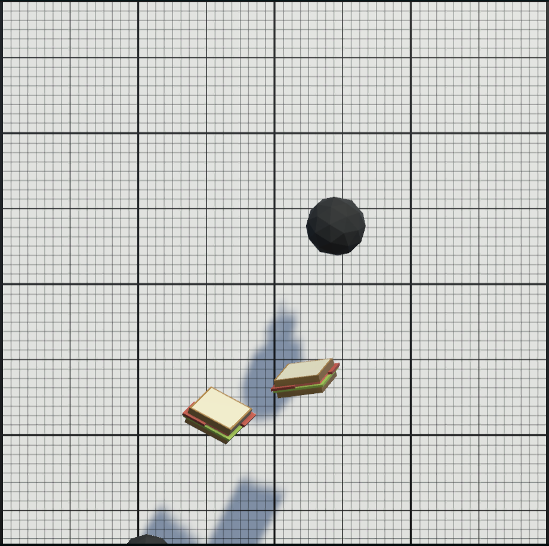

# Ninja - A Fun Fruit Slicing Game

Welcome to Ninga, a delightful fruit slicing game crafted in Unity! Slice your way through juicy fruits and earn high scores in this addictive, action-packed adventure. With simple physics and charming low-poly 3D visuals, Ninga is perfect for web browsers, offering hours of entertainment.

## How to play

Slice the Food: Use your mouse or touch screen to slice through fruits as they appear on the screen.

Avoid Bombs: Be careful not to slice any bombs! Slicing a bomb ends the game.

Earn High Scores: The more fruits you slice, the higher your score. Aim for combos to achieve the highest score possible.

## Play Now

Play Ninja in your web browser and put your fruit-slicing skills to the test! [Play Ninja Now](https://aliqadir.itch.io/ninja)

## Features

- Simple and Addictive: Easy-to-learn gameplay keeps you hooked for hours.
- Low-Poly 3D Graphics: Enjoy charming, minimalist visuals.
- Physics-Based: Experience realistic slicing action.

## Credits

The game was devleoped by Ali Qadir
Low Poly 3D assets from Unity Learn
Built using Unity engine

## License

This project is licensed under the MIT License. Feel free to modify and use any of the code for your own purposes, but please credit the original author if you share or distribute any modified versions of this project. See the [LICENSE](./LICENSEtxt) file for details.

## Contact

If you have any questions or suggestions, feel free to contact me at [LinkedIn](https://www.linkedin.com/in/ali--qadir) or [Instagram](https://www.instagram.com/oily.oli/).
